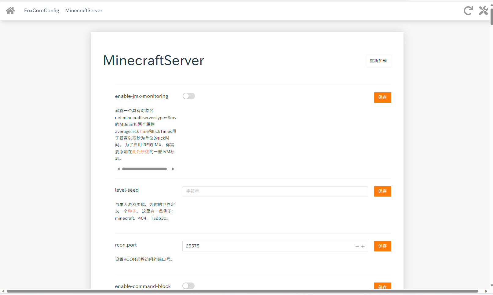
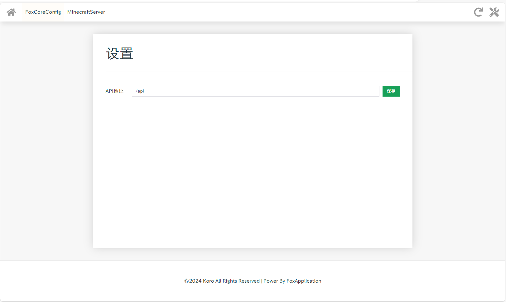
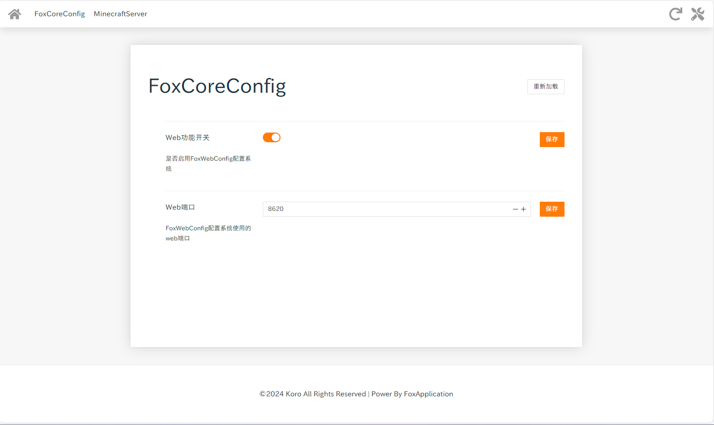

# Fox MC Project

## FoxCore
FoxCore是一个用于提供工具库和跨平台的配置文件支持的框架。
当前已支持以下几种配置文件形式：
1. toml（默认）
2. Json
3. Setting  
  
推荐使用Toml。

> For users of other languages, web translators are recommended . The FoxCore front-end is fully compatible with web translators.

### 对于用户
FoxCore提供了以下功能：
1. MinecraftServer 在线配置文件管理
2. MinecraftServer MOTD的中文支持（中文会被自动转码，并且在载入时自动解码）

以上功能只在Fabric，NeoForge，Paper这三类服务器上生效，在这些功能的实现上我们没有使用Mixin，以确保最大的兼容性。

除此之外，FoxCore的前端是和后端完全独立的，也就是说，你可以使用任何一个FoxCore的前端访问任何FoxCore的后端，只需要在设置里填写对应服务器的地址即可（对于当前服务器，默认为/api）。

预览：



### 对于开发者
假设我们有以下一个配置文件bean
```java
@FileTypeInterface(type = FileType.TOML)//配置文件类型
@Data
public class FoxCoreConfig {
    @FieldAnnotation(name = "Web功能开关" ,value = "是否启用FoxWebConfig配置系统")//配置选项别名和注释
    boolean EnabledWebConfig = true;
    @FieldAnnotation(name = "Web端口" ,value = "FoxWebConfig配置系统使用的web端口")
    int WebPort = 8620;

}
```
我们可以这样配置
```java
//使用Bean创建本地配置
LocalFoxConfig localFoxCoreConfig = new LocalFoxConfig(FoxCoreConfig.class);
//这是Bean配置接口
BeanFoxConfig beanConfig = localFoxCoreConfig.getBeanFoxConfig();
```
`FoxCoreConfig.toml`文件在本地会被自动管理，其会被自动生成为这样：
```toml
# 是否启用FoxWebConfig配置系统
EnabledWebConfig = true
# FoxWebConfig配置系统使用的web端口
WebPort = 8621
```
你可以设置`LocalFoxConfig.setAutoLoad()`来启用自动重载功能，其会监听本地文件，在被修改后自动重载，你可以通过`BeanFoxConfig.addFieldChangedListener()`来添加监听器，当配置文件字段被修改后，会自动触发。
自动重载功能可以随时关闭。

#### WebConfig
你可以启用FoxConfigWebConfig系统以实现在线的配置文件管理。  
对于上文例子中的配置文件，其会被生成为这样：

